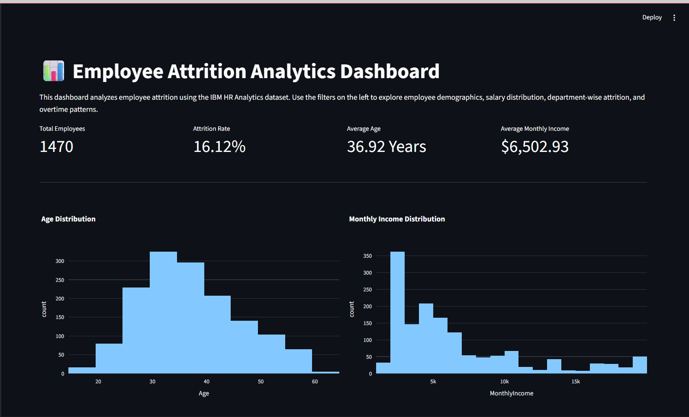
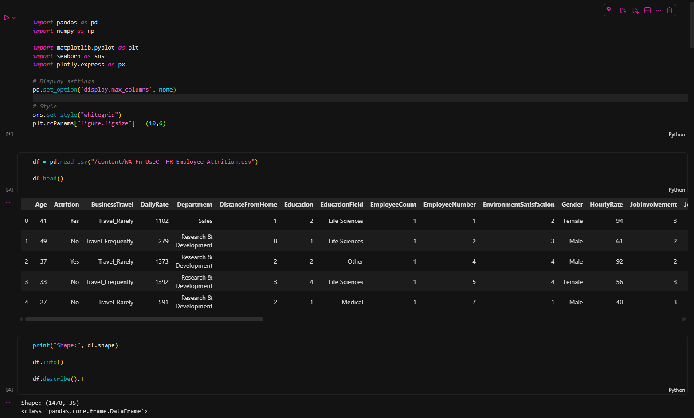
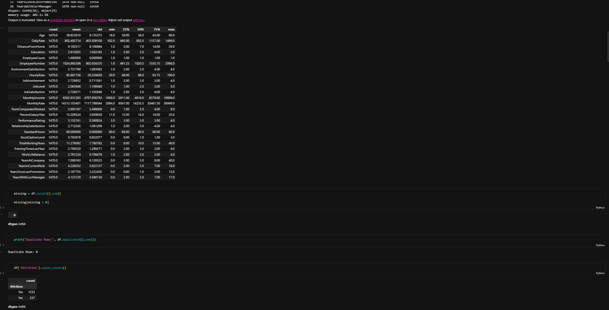
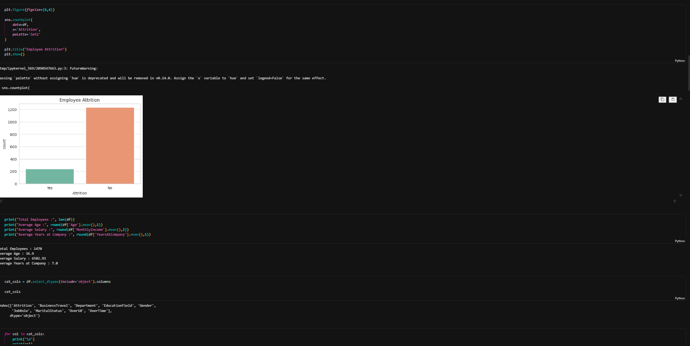
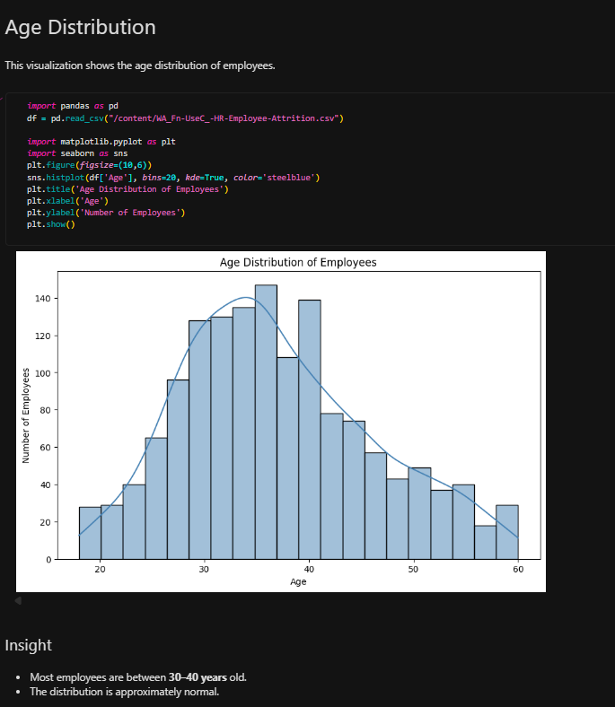
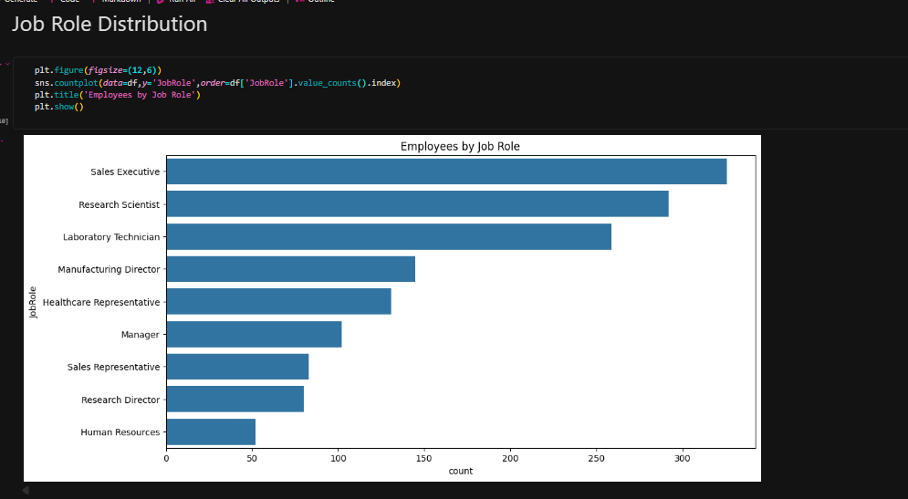
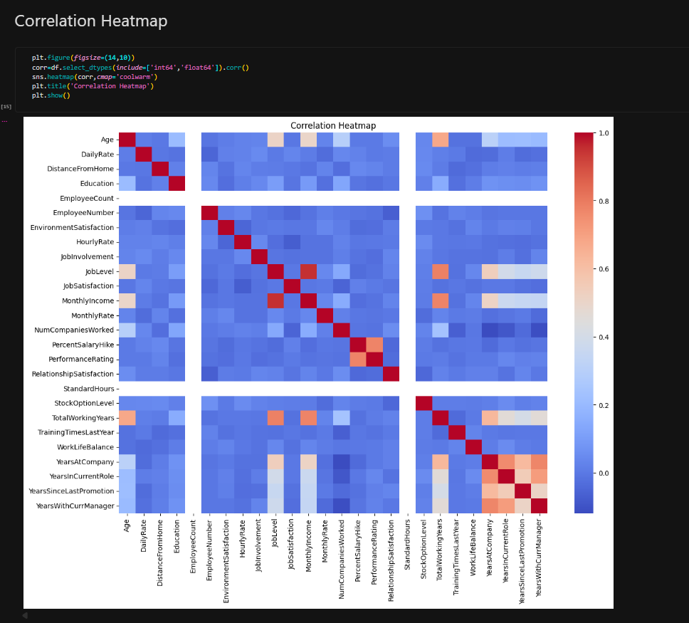

📊 Employee Attrition Analytics Dashboard

An interactive Employee Attrition Analytics Dashboard developed using **Python, Streamlit, Pandas, and Plotly**. This project analyzes employee attrition patterns through Exploratory Data Analysis (EDA) and interactive visualizations to help understand factors affecting employee retention.

---

 📌 Project Overview

Employee attrition is an important HR challenge that impacts organizational performance. This project uses the IBM HR Analytics Employee Attrition dataset to explore employee demographics, income, departments, overtime, and attrition trends.

The project consists of:

- Exploratory Data Analysis (EDA)
- Interactive Data Visualization
- Streamlit Dashboard
- HR Business Insights

---

 🚀 Features

- Interactive dashboard built with Streamlit
- Department, Gender, and Attrition filters
- KPI cards
  - Total Employees
  - Attrition Rate
  - Average Age
  - Average Monthly Income
- Age Distribution
- Monthly Income Distribution
- Department-wise Employee Analysis
- Job Role Analysis
- Attrition Analysis
- Overtime vs Attrition
- Dataset Preview

---

 🛠️ Technologies Used

- Python
- Pandas
- NumPy
- Streamlit
- Plotly
- Matplotlib
- Seaborn

---

 📂 Project Structure

```
Employee-Attrition-Analytics/
│
├── data/
│   └── WA_Fn-UseC_-HR-Employee-Attrition.csv
│
├── notebooks/
│   └── employee_attrition_eda.ipynb
│
├── dashboard/
│   └── app.py
│
├── images/
│
├── README.md
├── requirements.txt
└── .gitignore
```

---

 📊 Dashboard Preview

Add screenshots of your dashboard inside the `images` folder.

Example:

```
images/
├── dashboard.png
├── eda.png
```

Then include them like this:









```

---

 📈 Exploratory Data Analysis

The notebook includes:

- Data Loading
- Dataset Information
- Missing Value Analysis
- Duplicate Value Check
- Summary Statistics
- Age Distribution
- Gender Distribution
- Department Analysis
- Job Role Analysis
- Monthly Income Distribution
- Attrition Analysis
- Correlation Heatmap
- Business Insights

---

💡 Key Insights

- Employees working overtime show a higher attrition rate.
- Most employees are between 30 and 40 years old.
- Research & Development has the largest workforce.
- Monthly income varies significantly across different job roles.
- Employee attrition is influenced by multiple workplace and demographic factors.

---

 📁 Dataset

**Dataset:** IBM HR Analytics Employee Attrition & Performance

The dataset contains information about employees including:

- Age
- Gender
- Department
- Job Role
- Education
- Monthly Income
- Overtime
- Years at Company
- Job Satisfaction
- Attrition Status

---

 ▶️ How to Run the Project

1. Clone the Repository

```bash
git clone https://github.com/charlie00769/CodeAlpha_Employee_Analytics.git
```

 2. Navigate to the Project Folder

```bash
cd CodeAlpha_Employee_Analytics
```

 3. Install Dependencies

```bash
pip install -r requirements.txt
```

 4. Run the Dashboard

```bash
python -m streamlit run dashboard/app.py
```

---

📚 Internship Tasks Completed

 ✅ Task 2 – Exploratory Data Analysis (EDA)

- Data Cleaning
- Data Exploration
- Statistical Analysis
- Business Insights

✅ Task 3 – Data Visualization

- Interactive Dashboard
- KPI Cards
- Charts
- Filtering Options

---

 👨‍💻 Author

**Kaustubh Valanjuwani**

B.Tech Artificial Intelligence & Data Science

CodSoft Data Analytics Internship

GitHub: https://github.com/charlie00769

---

⭐ Support

If you found this project useful, consider giving it a ⭐ on GitHub.
